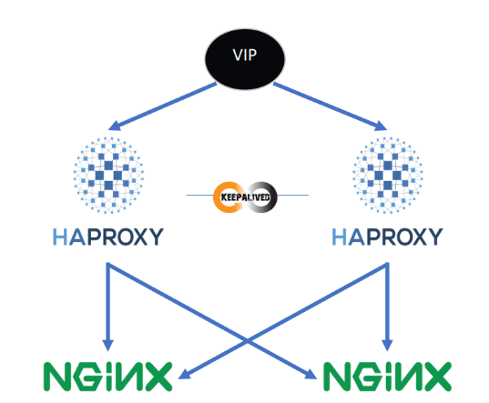

# _ESAME FINALE CLOUD SECURITY:_

_Gruppo composto da:_
- Mattia Cossu
- Alessandro Eleuteri
- Alessandro Lupini

_Descrizione compito:_

Creazione di un’infrastruttura composta da: due [Nginx](http://nginx.org/en/download.html) con il compito di webserver, due [HAPROXY](https://www.haproxy.org/) con attivo il demone __"KeepAlived"__ il quale ha il compito di bilanciare il traffico in arrivo; arrivando poi a creare una topologia come in foto:



_Tecnologie utilizzate:_

- [Nginx](http://nginx.org/en/download.html)
- [HAPROXY](https://www.haproxy.org/) + KeepAlived
- [Docker](https://www.docker.com/products/docker-desktop/)

_Procedimento:_

L'intera infrastruttura viene inizializzata tramite il file __"docker-compose.yaml"__ con il relativo codice:
```yaml
version: '3'

services:
  web_server1:
    build:
      context: ./nginx
      dockerfile: Dockerfile
    container_name: web_server1
    ports:
      - "8080:80"
    networks:
      - project_network

  web_server2:
    build:
      context: ./nginx
      dockerfile: Dockerfile
    container_name: web_server2
    networks:
      - project_network

  lb1:
    build:
      context: ./haproxy
      dockerfile: Dockerfile
    container_name: lb1
    networks:
      - project_network
    privileged: true
    cap_add:
      - NET_ADMIN
    volumes:
      - ./haproxy/keepalived.conf:/etc/keepalived/keepalived.conf
    depends_on:
      - web_server1
      - web_server2

  lb2:
    build:
      context: ./haproxy
      dockerfile: Dockerfile
    container_name: lb2
    networks:
      - project_network
    privileged: true
    cap_add:
      - NET_ADMIN
    volumes:
      - ./haproxy/keepalived.conf:/etc/keepalived/keepalived.conf
    depends_on:
      - web_server1
      - web_server2

networks:
  project_network:
    driver: bridge

```
Possiamo osservare che all'interno della sezione __"services"__ vengono istaziati quattro servizi i primi due sono i __"web_server"__ (Nginx), prendono il loro codice dal loro relativo dockerfile,   


Risposta 1:

_Implementare la cache su webserver o sul load balancer dipende molto dall'infrastruttura di rete però utilizzerei come primo metro di scelta la potenza di calcolo, in base a chi ne ha di più implementerei la funzione di caching o sul load balancer o sul webserver. Altra metrica sarebbe basato su come è organizzato il sito che serviamo infatti se abbiamo un'alta presenza di pagine statiche affiderei il caching al load balancer invece se abbiamo diverse pagine dinamiche implementiamo il caching verso i webserver._

Risposta 2:

_Le componenti che avrei conteinerizzato sono i 2 webserver per fattori di sicurezza infatti avrei un ambiente isolato, velocità di building data dal docker, gestione semplificata delle dipendeze e delle configurazioni in quanto con un file docker posso impostare il tutto_

Risposta 3:

_Nell'architettura implementata assegnerei il virtual IP ai load balancer, in quanto gestirà il traffico e il tutto verrà ridistributo ai vari webservers inoltre in caso che uno dei Haproxy muoia abbiamo a disposizione il rimanente che gestirà il resto_

Risposta 4:

_Le vulnerabilità che possiamo riscontrare e le relative mitigazioni sono:_

- Request smuggling = tenere sempre aggiornati alle versioni più recenti i proxy

- Accesso non autorizzato = implementare gli accessi tramite SSH (con fail2ban) e whitlistare gli ip che possono connettersi 

- XSS, SQLI, ecc... = un WAF da mettere davanti i load balancer che filtri le richieste a livello 7

- Attacchi DDoS = firewall che filtri il traffico di rete

- Modifica dei filesystem tramite accessi non autorizzati = implementare una soluzione open-source come tripwire che permette di controllare se vi sono cambiamenti nei filesystems

Risposta 5:

_Le metriche che monitorerei per valutare le prestazioni dei load balancer sono:_

1) Connessioni attive: capire quante connessioni attive ci sono e come sono ditribuite tra i vari webserver

2) Latenza: il tempo impiegato per servire la pagina richiesta

3) Connessioni fallite: capire quante connessioni falliscono e specialmente i motivi per cui falliscono

4) Risorse utilizzate: valutare quante risorve vengono consumate da essi

5) Throughput: vedere la capacità massima del load balancer ci permette di capire il carico massimo che può sopportare
